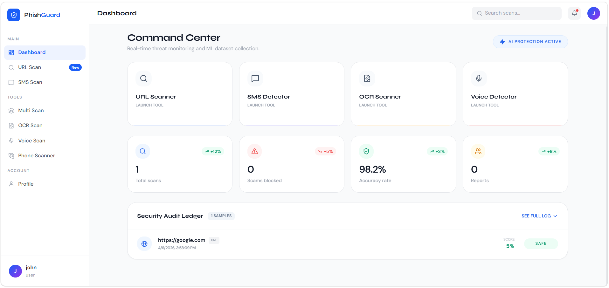
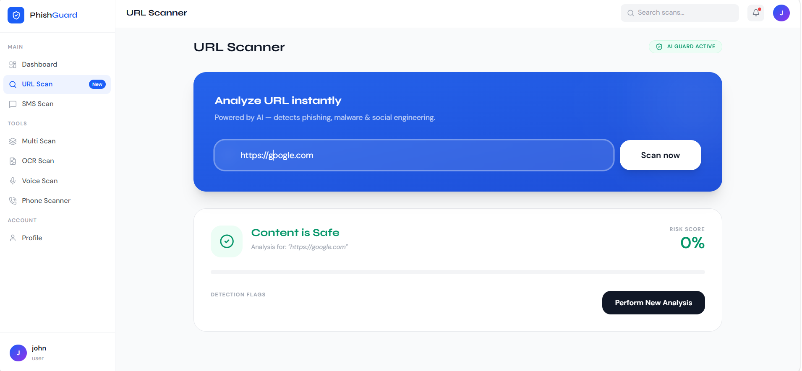

# 🛡️ PhisGuard — Phishing & Scam Detection System

> An AI-powered cybersecurity platform using **Random Forest ML**, **XAI**, **feature engineering**, and **Google APIs** for semantic and heuristic phishing detection.

---

## 📌 Problem Statement

Phishing and online scams cause billions in losses annually. Traditional detection systems often fail against:

- Semantically disguised phishing messages  
- Brand impersonation URLs  
- AI-generated voice scams  
- Fake payment screenshots  

**PhisGuard** solves this by combining **ML**, **vector similarity / semantic analysis**, and **heuristics** for accurate, context-aware threat detection.

---

## 🧠 System Design
User Input (URL / SMS / Phone / Document / Audio)
        │
        ▼
┌────────────────────────────┐
│ Feature Extraction Engine  │
│ - URL entropy             │
│ - WHOIS domain age        │
│ - HTTPS check             │
│ - Brand similarity        │
└────────────┬──────────────┘
             │
             ▼
┌────────────────────────────┐
│ Machine Learning Model     │
│ - Random Forest           │
│ - Feature Engineering     │
└────────────┬──────────────┘
             │
             ▼
┌────────────────────────────┐
│ Semantic Analysis Layer    │
│ - Google APIs             │
│ - Sentence Embeddings     │
│ - Context similarity      │
└────────────┬──────────────┘
             │
             ▼
┌────────────────────────────┐
│ Risk Scoring Engine        │
│ - Weighted scoring         │
│ - ML + heuristic fusion    │
└────────────┬──────────────┘
             │
             ▼
      Final Output
 (SAFE / WARNING / SCAM)


---

## ⚡ Tech Stack

| Layer | Technology |
|---|---|
| Backend | Python (Flask + Flask-CORS) |
| Frontend | React + Tailwind CSS |
| Database | MongoDB Atlas |
| Authentication | JWT |
| Machine Learning | Random Forest, Feature Engineering, XAI |
| Semantic / Vector Analysis | Google APIs, sentence-transformers embeddings |
| OCR & Vision | Tesseract.js |
| PDF Processing | PDF.js |
| WHOIS & URL Analysis | python-whois, tldextract |

---

## 🚀 Features

- 🔍 **URL Scanner** — Heuristics + ML + Semantic Analysis  
- 💬 **SMS Detector** — Keyword + vector similarity  
- 📱 **Phone Number Checker** — Blacklist + prefix analysis  
- 📦 **Bulk URL Scan** — Parallel CSV processing  
- 👁️ **Vision AI (OCR)** — Detects screenshot forgeries  
- 🎙️ **Voice Detection** — AI-generated speech pattern analysis  
- 🎓 **Safety Academy** — Gamified cybersecurity education  
- 📊 **Analytics Dashboard** — Real-time scan statistics  
- 🌍 **Live Threat Feed** — Animated threat alerts  

---

## ⚙️ Setup & Installation

### Prerequisites

- Python 3.8+  
- Node.js & npm  
- Git  

## ⚙️ Setup & Installation

### Prerequisites

* Python 3.8+
* Node.js & npm
* Git

---

## 🚀 Steps to Run the Project

### Step 1 — Clone the repository

```bash
git clone https://github.com/ShivaniSingh-2923/PhisGuard.git
cd PhisGuard
```

### Step 2 — Backend Setup

```bash
pip install -r requirements.txt
python app.py
```

### Step 3 — Frontend Setup

```bash
cd frontend
npm install
npm start
```

---

## 🌐 Open the Application

Visit:
http://localhost:3000

You can now scan:

* URLs
* SMS
* Phone numbers
* Documents
* Audio

---

## 📊 Detection Logic

| Check                 | Weight | Method           |
| --------------------- | ------ | ---------------- |
| Unverified domain     | +40    | WHOIS            |
| New domain (<30 days) | +50    | WHOIS            |
| Brand impersonation   | +45    | String matching  |
| Suspicious TLD        | +30    | TLD check        |
| High entropy          | +20    | Shannon entropy  |
| HTTP (no SSL)         | +15    | Protocol check   |
| ML prediction         | +25    | Random Forest    |
| Semantic match        | +30    | Google API + XAI |

---

## 📦 Dataset

Dataset is not included due to size and security reasons.
You can use any phishing dataset (e.g., Kaggle phishing URLs dataset).

---

## 🚨 Final Verdict Logic

* **SCAM** → Score ≥ 75
* **WARNING** → Score ≥ 40
* **SAFE** → Score < 40

---

## 📁 Project Structure

PhisGuard/
├── app.py                # Backend + ML + Semantic Analysis
├── frontend/             # React + Tailwind UI
├── templates/            # HTML templates (if any)
├── requirements.txt
├── README.md
└── ...

---

## 📸 Screenshots

### Dashboard



### Scan Result




---

## 👨‍💻 Author

Built as a personal project focusing on AI-powered cybersecurity, combining Machine Learning, Feature Engineering, and Explainable AI (XAI) to detect real-world phishing attacks.

---

## 🚀 Update README on GitHub

```bash
git add README.md
git commit -m "Update README with final clean version"
git push
```
